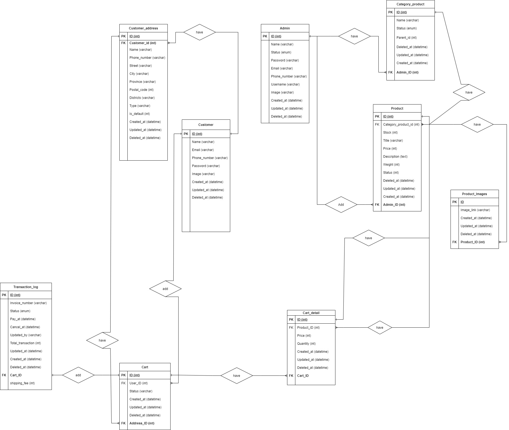

# Alta Store Backend
## :orange_book: Description
Alta store RESTful API to serve altastore online web store. This code use clean code architecture, JSON web token verification, echo golang framework and some docker config stuff. This source code accomodate how customers do shopping like registration, make order, make transaction, finishing payment, etc and how admins manage the products in alta store like add products, create categories, remove products, etc.
#### :alien: Technologies stacks
1. Go 
1. Echo Golang
1. Mockery
1. JWT
1. MySql
1. Docker
1. AWS EC2
1. AWS S3
1. AWS RDS
1. Github Actions

## :computer: System Design
### Entity Relational Database Design

### :open_book: API Documentation
https://app.swaggerhub.com/apis-docs/Mhakimamransyah/alta-store/1#/

